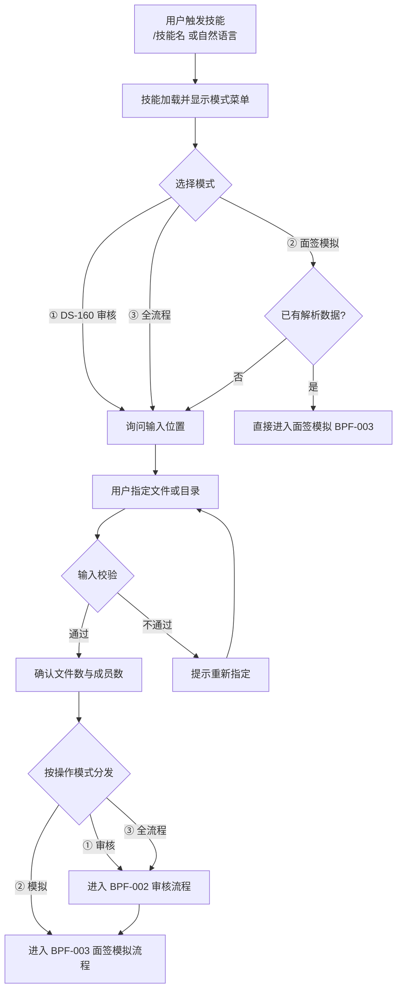
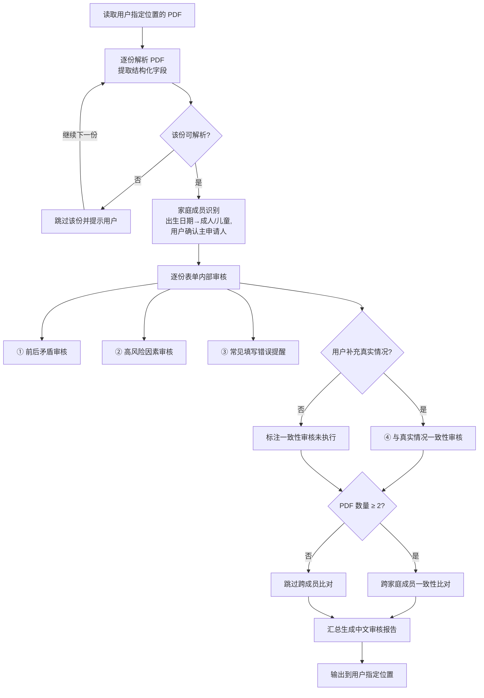
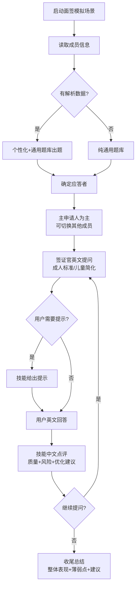
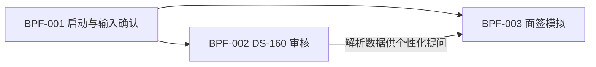

# 业务流程

## 元信息

| 属性 | 值 |
|------|-----|
| 项目编码 | PRJ-001 |
| 项目名称 | 美签DS-160审核与面签模拟Skill |
| 文档版本 | v1.1 |
| 创建日期 | 2026-08-03 |
| 最后更新 | 2026-08-03 |

---

## 业务流程总览

本技能以家庭为单位服务美国 B1/B2 签证准备，核心流程为：技能启动与输入确认 → DS-160 审核 → 面签模拟。审核结果可衔接面签模拟（个性化提问的数据基础），两个模块既可独立运行也可串联。

| 流程编号 | 流程名称 | 涉及角色 | 关联需求 | 触发条件 |
|---------|---------|---------|---------|---------|
| BPF-001 | 技能启动与输入确认 | 用户、技能 | REQ-001, REQ-016 | 用户触发技能 |
| BPF-002 | DS-160 审核流程 | 用户、技能 | REQ-002~009 | 用户选择审核模式并指定输入 |
| BPF-003 | 面签模拟流程 | 用户、家庭成员、技能 | REQ-010~015 | 用户选择模拟模式 |

**明确排除范围（本技能不做）：** 签证缴费、面签预约、材料清单辅助、签证状态查询、其他国家签证相关功能。

---

## 流程详情

### BPF-001：技能启动与输入确认

**流程说明：**
用户在 Claude Code 中触发技能后，技能引导用户确认操作模式与输入位置。输入位置必须由用户明确指定，技能不擅自扫描其他目录。本流程是 BPF-002/003 的入口。

**涉及角色：**
- 用户：触发技能、指定操作模式与输入位置
- 技能：加载引导、校验输入、分发至对应流程

**流程图：**

**步骤说明：**

| 步骤 | 操作人/系统 | 操作描述 | 输入 | 输出 | 异常处理 |
|------|-----------|---------|------|------|---------|
| 1 | 用户 | 触发技能（/技能名 或自然语言） | 无 | 技能启动 | — |
| 2 | 技能 | 加载并显示模式菜单（①审核 ②模拟 ③全流程） | 技能定义 | 模式菜单 | — |
| 3 | 用户 | 选择操作模式 | 模式选择 | 模式指令 | — |
| 4 | 技能 | 询问输入位置（若需读取 PDF） | 模式 | 输入位置询问 | 未指定时反复提示 |
| 5 | 用户 | 指定文件或目录 | 文件/目录路径 | 输入位置 | — |
| 6 | 技能 | 校验输入存在且含 DS-160 PDF | 输入位置 | 校验结果 | 校验失败提示重新指定 |
| 7 | 技能 | 确认文件数量、推断成员数 | 校验结果 | 读取清单 | — |
| 8 | 技能 | 按操作模式分发：①审核→BPF-002；②模拟→BPF-003；③全流程→先 BPF-002 后 BPF-003 | 读取清单+模式 | 流程入口 | — |

**业务规则：**
1. 输入位置必须由用户指定，技能不得擅自扫描指定范围以外的文件（REQ-001）。
2. 未指定输入位置时，技能明确提示，不得自行猜测（REQ-001）。
3. 面签模拟若无解析数据，可退化为纯通用题库模式，不阻塞使用（REQ-013）。
4. 技能须支持 /技能名 与自然语言两种触发方式（REQ-016）。

---

### BPF-002：DS-160 审核流程

**流程说明：**
读取用户指定位置的多份 DS-160 完整表单 PDF，逐份解析为结构化数据，执行四类审核维度（前后矛盾、高风险因素、常见填写错误、与真实情况一致性），并对多份 PDF 做跨成员一致性比对，最终生成中文审核报告输出到用户指定位置。

**涉及角色：**
- 用户：提供输入位置、补充真实情况说明、指定报告输出位置
- 技能：解析、审核、比对、生成报告

**流程图：**

**步骤说明：**

| 步骤 | 操作人/系统 | 操作描述 | 输入 | 输出 | 异常处理 |
|------|-----------|---------|------|------|---------|
| 1 | 技能 | 读取用户指定位置的全部 DS-160 PDF | 文件/目录 | PDF 清单 | 无文件时提示 |
| 2 | 技能 | 逐份解析 PDF，提取结构化字段 | PDF | 结构化数据 | 扫描件跳过并提示 |
| 3 | 技能 | 依出生日期识别成员类型（成人/儿童），并请用户确认主申请人（面签主应答者） | 结构化数据 | 成员档案 | 信息不足默认成人；主申请人在 BPF-001 步骤 7 或本步确认 |
| 4 | 技能 | 逐份执行前后矛盾审核 | 成员档案 | 矛盾清单 | — |
| 5 | 技能 | 逐份执行高风险因素审核 | 成员档案 | 风险清单 | — |
| 6 | 技能 | 逐份执行常见填写错误提醒 | 成员档案 | 错误清单 | — |
| 7 | 技能 | （可选）结合用户补充信息做一致性审核 | 成员档案+补充信息 | 差异清单 | 无补充则标注未执行 |
| 8 | 技能 | 多份 PDF 跨成员一致性比对 | 多成员档案 | 跨成员差异 | 仅 1 份则跳过 |
| 9 | 技能 | 汇总生成中文审核报告（总体结论+逐成员+逐项发现+风险等级+修改建议+面签提示/易被质疑点） | 全部审核结果 | 报告内容 | — |
| 10 | 技能 | 输出报告到用户指定位置 | 报告内容 | 报告文件 | 位置不可写时提示 |

**业务规则：**
1. 四类审核维度均纳入审核框架（REQ-004~007）；其中一致性维度在无补充真实情况时标注"未执行"，其余维度全部执行。
2. 跨成员一致性比对仅在 ≥2 份 PDF 时执行（REQ-008，依赖 REQ-003）。
3. 一致性审核依赖用户补充真实情况，未补充时在报告中标注"未执行"而非默认通过（REQ-007）。
4. 报告为中文，含逐字段检查、风险等级、修改建议、面签提示，输出到用户指定位置（REQ-009）。
5. 敏感数据不脱敏、仅在本仓库内流转（关键假设 4）。

---

### BPF-003：面签模拟流程

**流程说明：**
以家庭一起面签为场景，还原真实面签流程（问候→提问→追问→收尾）。签证官用英文提问（基于 DS-160 真实资料的个性化问题 + 通用题库），用户用英文回答，技能逐答给出中文点评与优化建议。成人成员用标准题库，未成年成员用简化题库。

**涉及角色：**
- 用户/家庭成员：应答者（主申请人为主，可切换其他成员）
- 技能：扮演签证官（出题+追问）、点评官（点评+建议）

**流程图：**

**步骤说明：**

| 步骤 | 操作人/系统 | 操作描述 | 输入 | 输出 | 异常处理 |
|------|-----------|---------|------|------|---------|
| 1 | 技能 | 启动面签模拟场景 | 模式指令 | 场景环境 | — |
| 2 | 技能 | 读取已解析成员信息 | 成员档案 | 成员列表 | 无数据则通用题库 |
| 3 | 技能 | 生成提问序列（个性化+通用） | 成员档案/题库 | 问题序列 | — |
| 4 | 技能 | 确定应答者（主申请人为主） | 成员列表 | 应答者 | 可随时切换 |
| 5 | 技能 | 签证官英文提问（按应答者分龄） | 问题序列 | 英文问题 | — |
| 6 | 技能 | 用户英文回答 | 英文问题 | 回答 | 用户可请求提示 |
| 7 | 技能 | 中文点评：质量评估+风险提示+优化建议（含英文示例） | 回答 | 点评 | — |
| 8 | 技能 | 判断是否继续提问 | 用户指令 | 继续/结束 | — |
| 9 | 技能 | 收尾总结整体表现与改进建议 | 全部问答 | 总结 | — |

**业务规则：**
1. 出题与点评使用中文，签证官模拟对话使用英文（REQ-011）。
2. 主申请人为主要应答者，可穿插切换其他家庭成员（REQ-010）。
3. 未成年成员套用简化题库，不涉及工作、收入、移民倾向类深问（REQ-015）。
4. 用户每个回答都必须给出中文点评与优化建议（REQ-014）。
5. 个性化问题须引用具体 DS-160 资料，与通用题库结合使用（个性化为主、通用为辅）（REQ-012、REQ-013）。

---

## 流程间关系图

BPF-002 产出的结构化成员数据是 BPF-003 个性化提问的数据基础；BPF-003 在无解析数据时可独立运行（纯通用题库）。

---

## 变更记录

| 日期 | 版本 | 变更内容 | 原因 |
|------|------|---------|------|
| 2026-08-03 | v1.0 | 初始版本 | 基于需求清单与成功标准生成 |
| 2026-08-03 | v1.1 | 修正 BPF-001 分发分支；BPF-003 规则 5 删除无依据数值；补充主申请人确认、回边标签、规则措辞、面签提示落地、排除范围声明 | P4 第 1 轮审核问题修正 |
